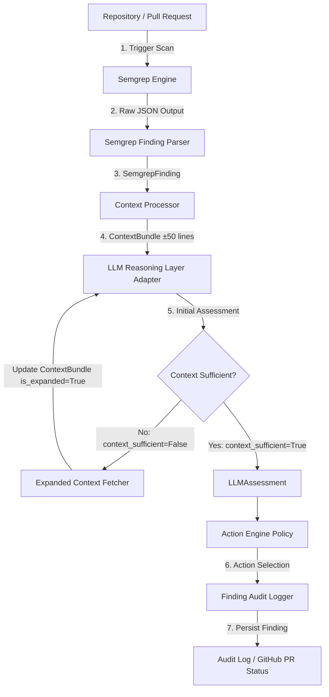

# SentinelCI Workflow & Pipeline Specification

SentinelCI is an intelligent CI/CD security scanner that pairs deterministic static analysis (Semgrep) with an LLM reasoning engine to drastically minimize false positives in automated code reviews.

This document details the end-to-end data flow, execution pipeline, and component interactions across SentinelCI.

---

## High-Level Architecture Diagram

---

## Detailed Pipeline Execution Steps

### 1. Semgrep Static Analysis Pass
- **Input**: Source code repository, PR diff, or target branch.
- **Process**: Executes Semgrep CLI (`semgrep --json`) configured with targeted security rules.
- **Output**: JSON payload containing raw findings.
- **Data Contract**: Parsed into `SemgrepFinding` objects (`rule_id`, `file_path`, `start_line`, `end_line`, `severity`, `message`, `matched_code`).

### 2. Context Extraction & Bundle Creation (`app/git_ops.py`)
- **Input**: Target source file and `SemgrepFinding`.
- **Process**:
  - `GitOps.read_file()` reads source file locally from runner disk using UTF-8 (`errors="replace"`).
  - `GitOps.read_lines_around()` extracts ±50 surrounding lines using 1-indexed to 0-indexed bounded line clamping.
  - `GitOps.blame()` runs local `git blame` subprocess for commit context.
  - Identifies enclosing function name (`enclosing_function`) and collects nearby comments.
- **Data Contract**: `ContextBundle` (`file_path`, `flagged_code`, `surrounding_lines`, `enclosing_function`, `nearby_comments`, `is_expanded=False`, `expanded_files=[]`).

### 3. LLM Reasoning Pass (Provider Adapter)
- **Input**: `SemgrepFinding` + `ContextBundle`.
- **Process**:
  - Formats prompt for LLM provider (OpenAI, Anthropic, Gemini, etc.).
  - Evaluates code logic, data flow, variable sanitization, and surrounding context.
  - Determines confidence level and vulnerability category.
- **Data Contract**: `LLMAssessment` (`confidence`, `category`, `reasoning`, `context_sufficient`).

### 4. Dynamic Context Expansion Pass (Conditional) (`app/git_ops.py`)
- **Trigger**: `LLMAssessment.context_sufficient == False`.
- **Process**:
  - `GitOps.find_related_files()` discovers sibling files or import references.
  - `GitOps.diff_against_base()` retrieves raw git diff against base branch for change context.
  - Updates `ContextBundle`: sets `is_expanded = True` and appends filenames to `expanded_files`.
  - Re-executes LLM reasoning pass with enriched context.

### 5. Action Engine Policy Triaging
- **Input**: `SemgrepFinding.severity` + `LLMAssessment.confidence`.
- **Process**: Evaluates finding against policy matrix:
  - **`BLOCK_BUILD`**: e.g., CRITICAL / HIGH severity + HIGH confidence.
  - **`MANUAL_REVIEW`**: e.g., HIGH / MEDIUM severity + MEDIUM confidence or context uncertainty.
  - **`BUILD_PASS`**: e.g., False positives (LOW confidence) or LOW severity findings that fail safety thresholds.
- **Data Contract**: Returns `Action` enum.

### 6. Audit Logging & Notification
- **Input**: `SemgrepFinding`, `ContextBundle`, `LLMAssessment`, `Action`, metadata (`repo`, `pr_number`, `head_sha`).
- **Process**: Assembles complete `Finding` record, assigns `finding_id`, and writes to persistent audit log/database and updates GitHub PR checks.

---

## Data Model Interconnections

| Model Name | Role in Workflow |
| :--- | :--- |
| **`Severity`** | Deterministic static severity from Semgrep rule metadata (never modified by LLM). |
| **`Confidence`** | Independent AI assessment axis indicating confidence in true-positive status. |
| **`Action`** | Pipeline decision outcome (`BLOCK_BUILD`, `MANUAL_REVIEW`, `BUILD_PASS`). |
| **`SemgrepFinding`** | Contract for raw Semgrep JSON parsing output. |
| **`ContextBundle`** | Provider-agnostic payload containing code surroundings and expansion tracking. |
| **`LLMAssessment`** | Standardized response structure from any LLM provider adapter. |
| **`Finding`** | Complete persistent audit record combining finding, context, AI assessment, and action. |
